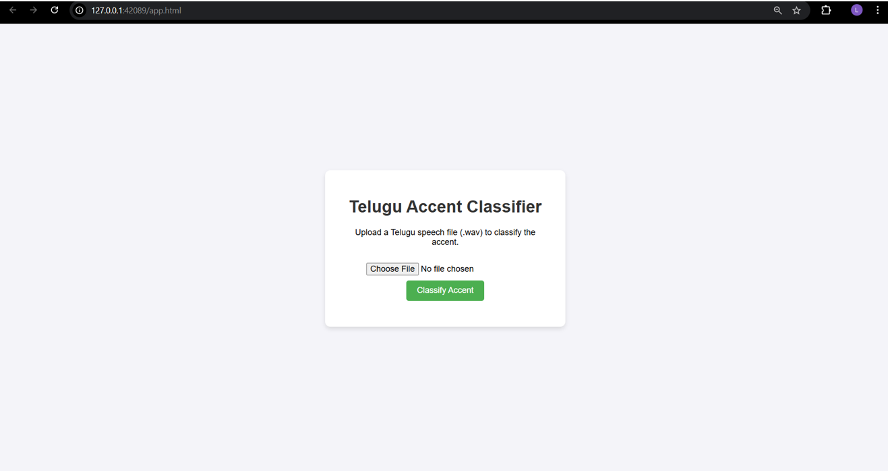
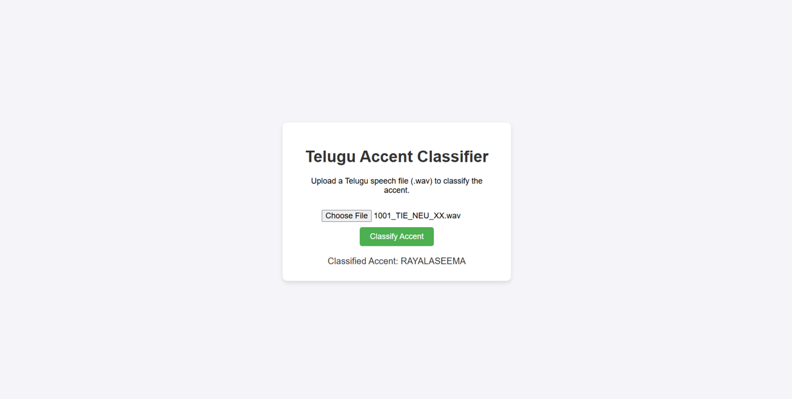

# Telugu Accent Classifier

A machine learning-based web application that classifies Telugu accents from audio recordings. This project uses a Support Vector Machine (SVM) model to identify different Telugu accent patterns from audio input.

## Features

- Real-time audio recording through the web interface
- Audio file upload capability
- Instant accent prediction
- User-friendly Streamlit interface
- Download recorded audio for further analysis

## Screenshots

### Recording Interface



### Prediction Results



## Project Structure

```
├── Application/
│   ├── app.py              # Main Streamlit application
│   ├── demo.py             # Demo script
│   ├── setup.py            # Setup configuration
│   └── svm_accent_model.pkl # Pre-trained SVM model
├── Notebooks/              # Jupyter notebooks for model development
├── Test Data/              # Test audio samples
└── Screens/                # Application screenshots
```

## Installation

1. Clone the repository:

```bash
git clone https://github.com/yourusername/telugu-accent-classifier.git
cd telugu-accent-classifier
```

2. Install the required dependencies:

```bash
pip install -r requirements.txt
```

## Usage

1. Start the Streamlit application:

```bash
cd Application
streamlit run app.py
```

2. Open your web browser and navigate to the provided local URL (typically http://localhost:8501)

3. Use the application:
   - Record your audio using the built-in recorder
   - Download the recorded audio
   - Upload the audio file for accent prediction
   - View the predicted accent result

## Model Information

The system uses a Support Vector Machine (SVM) model trained on various Telugu accent samples. The model analyzes audio features extracted using the librosa library to make predictions.

